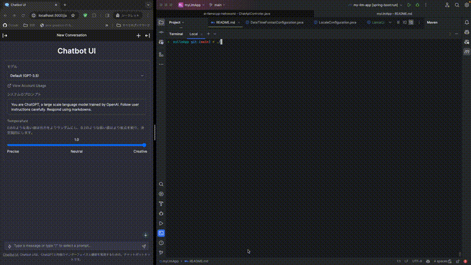

# Building a RAG Server with JHipster: Integrating Local LLM, OpenAI API, and Spring AI

This is a sample application for implementing RAG (Retrieval Argument Generation) using Local LLM, featuring [llama.cpp](https://github.com/ggerganov/llama.cpp) and [Java Bindings for llama.cpp](https://github.com/kherud/java-llama.cpp). It launches a server compatible with the OpenAI API on the Java platform and integrates [JHipster](https://www.jhipster.tech/) with [Spring AI](https://docs.spring.io/spring-ai/reference/index.html) and [pgvector](https://github.com/pgvector/pgvector). The application also includes the [BetterChatGPT](https://github.com/ztjhz/BetterChatGPT) UI and can be executed on a standalone PC.

Thank you for the wonderful OSS products and all the open LLMs.



Confirmed compatibility with Macbook Pro M3 (should also work on other OS).

## Usage

Prerequisites:

- Node.js 18 or higher
- Java 17 or higher
- Docker

Clone this repository and build:

```bash
./mvnw verify # downloads the LLM (mistral-7b-instruct-v0.2.Q2_K.gguf)
npm run docker:db:up # runs pgvector
./mvnw
```

When you execute the `./mvnw` command, the following actions are performed:

- Building the Java server
- Downloading and building the UI
- Launching the JHipster RAG server
- On the first launch only:
  - Downloading the embedding model (default is `e5-small-v2`)
  - Constructing pgvector tables

Using the Application:

- Access http://localhost:8080.
- Log in via the header menu 'Account' - 'Sign in' using the credentials 'user/user'.
- Upload a 'PDF file' through the 'File Upload' section in the header menu using drag & drop.
- In the 'Chat' section:
  - By default, it functions as a basic chat application using the local LLM.
  - Selecting 'gpt-4' from the menu (temporarily assigned for this sample) enables the RAG feature.
    - When you ask a question, the chat provides answers based on the content of the uploaded PDF file.

---

## Execute Your Own LLMs

Set the environment variables as follows:

```
# Inference model in gguf format
export SPRING_AI_LLAMA_CPP_MODEL_NAME=ELYZA-japanese-Llama-2-13b-fast-instruct-q8_0.gguf

# Embedding model in ONNX format
export SPRING_AI_EMBEDDING_TRANSFORMER_TOKENIZER_URI=https://huggingface.co/intfloat/multilingual-e5-base/resolve/main/onnx/tokenizer.json
export SPRING_AI_EMBEDDING_TRANSFORMER_ONNX_MODEL_URI=https://huggingface.co/intfloat/multilingual-e5-base/resolve/main/onnx/model.onnx
```

- For the inference model, download a gguf format model readable by llama.cpp and deploy it to the 'models' directory.
- For the embedding model, set the environment variable; the ONNX model will be downloaded automatically to `~/.djl.ii` when the server launches.

# Original JHipster README.md

This application was generated using JHipster 8.1.0, you can find documentation and help at [https://www.jhipster.tech/documentation-archive/v8.1.0](https://www.jhipster.tech/documentation-archive/v8.1.0).

## Project Structure

Node is required for generation and recommended for development. `package.json` is always generated for a better development experience with prettier, commit hooks, scripts and so on.

In the project root, JHipster generates configuration files for tools like git, prettier, eslint, husky, and others that are well known and you can find references in the web.

`/src/*` structure follows default Java structure.

- `.yo-rc.json` - Yeoman configuration file
  JHipster configuration is stored in this file at `generator-jhipster` key. You may find `generator-jhipster-*` for specific blueprints configuration.
- `.yo-resolve` (optional) - Yeoman conflict resolver
  Allows to use a specific action when conflicts are found skipping prompts for files that matches a pattern. Each line should match `[pattern] [action]` with pattern been a [Minimatch](https://github.com/isaacs/minimatch#minimatch) pattern and action been one of skip (default if ommited) or force. Lines starting with `#` are considered comments and are ignored.
- `.jhipster/*.json` - JHipster entity configuration files

- `npmw` - wrapper to use locally installed npm.
  JHipster installs Node and npm locally using the build tool by default. This wrapper makes sure npm is installed locally and uses it avoiding some differences different versions can cause. By using `./npmw` instead of the traditional `npm` you can configure a Node-less environment to develop or test your application.
- `/src/main/docker` - Docker configurations for the application and services that the application depends on

## Development

### Doing API-First development using openapi-generator-cli

[OpenAPI-Generator]() is configured for this application. You can generate API code from the `src/main/resources/swagger/api.yml` definition file by running:

```bash
./mvnw generate-sources
```

Then implements the generated delegate classes with `@Service` classes.

To edit the `api.yml` definition file, you can use a tool such as [Swagger-Editor](). Start a local instance of the swagger-editor using docker by running: `docker compose -f src/main/docker/swagger-editor.yml up -d`. The editor will then be reachable at [http://localhost:7742](http://localhost:7742).

Refer to [Doing API-First development][] for more details.
Before you can build this project, you must install and configure the following dependencies on your machine:

1. [Node.js][]: We use Node to run a development web server and build the project.
   Depending on your system, you can install Node either from source or as a pre-packaged bundle.

After installing Node, you should be able to run the following command to install development tools.
You will only need to run this command when dependencies change in [package.json](package.json).

```
npm install
```

We use npm scripts and [Webpack][] as our build system.

Run the following commands in two separate terminals to create a blissful development experience where your browser
auto-refreshes when files change on your hard drive.

```
./mvnw
npm start
```

Npm is also used to manage CSS and JavaScript dependencies used in this application. You can upgrade dependencies by
specifying a newer version in [package.json](package.json). You can also run `npm update` and `npm install` to manage dependencies.
Add the `help` flag on any command to see how you can use it. For example, `npm help update`.

The `npm run` command will list all of the scripts available to run for this project.

### PWA Support

JHipster ships with PWA (Progressive Web App) support, and it's turned off by default. One of the main components of a PWA is a service worker.

The service worker initialization code is commented out by default. To enable it, uncomment the following code in `src/main/webapp/index.html`:

```html
<script>
  if ('serviceWorker' in navigator) {
    navigator.serviceWorker.register('./service-worker.js').then(function () {
      console.log('Service Worker Registered');
    });
  }
</script>
```

Note: [Workbox](https://developers.google.com/web/tools/workbox/) powers JHipster's service worker. It dynamically generates the `service-worker.js` file.

### Managing dependencies

For example, to add [Leaflet][] library as a runtime dependency of your application, you would run following command:

```
npm install --save --save-exact leaflet
```

To benefit from TypeScript type definitions from [DefinitelyTyped][] repository in development, you would run following command:

```
npm install --save-dev --save-exact @types/leaflet
```

Then you would import the JS and CSS files specified in library's installation instructions so that [Webpack][] knows about them:
Note: There are still a few other things remaining to do for Leaflet that we won't detail here.

For further instructions on how to develop with JHipster, have a look at [Using JHipster in development][].

## Building for production

### Packaging as jar

To build the final jar and optimize the myLlmApp application for production, run:

```
./mvnw -Pprod clean verify
```

This will concatenate and minify the client CSS and JavaScript files. It will also modify `index.html` so it references these new files.
To ensure everything worked, run:

```
java -jar target/*.jar
```

Then navigate to [http://localhost:8080](http://localhost:8080) in your browser.

Refer to [Using JHipster in production][] for more details.

### Packaging as war

To package your application as a war in order to deploy it to an application server, run:

```
./mvnw -Pprod,war clean verify
```

### JHipster Control Center

JHipster Control Center can help you manage and control your application(s). You can start a local control center server (accessible on http://localhost:7419) with:

```
docker compose -f src/main/docker/jhipster-control-center.yml up
```

## Testing

### Spring Boot tests

To launch your application's tests, run:

```
./mvnw verify
```

### Client tests

Unit tests are run by [Jest][]. They're located in [src/test/javascript/](src/test/javascript/) and can be run with:

```
npm test
```

## Others

### Code quality using Sonar

Sonar is used to analyse code quality. You can start a local Sonar server (accessible on http://localhost:9001) with:

```
docker compose -f src/main/docker/sonar.yml up -d
```

Note: we have turned off forced authentication redirect for UI in [src/main/docker/sonar.yml](src/main/docker/sonar.yml) for out of the box experience while trying out SonarQube, for real use cases turn it back on.

You can run a Sonar analysis with using the [sonar-scanner](https://docs.sonarqube.org/display/SCAN/Analyzing+with+SonarQube+Scanner) or by using the maven plugin.

Then, run a Sonar analysis:

```
./mvnw -Pprod clean verify sonar:sonar -Dsonar.login=admin -Dsonar.password=admin
```

If you need to re-run the Sonar phase, please be sure to specify at least the `initialize` phase since Sonar properties are loaded from the sonar-project.properties file.

```
./mvnw initialize sonar:sonar -Dsonar.login=admin -Dsonar.password=admin
```

Additionally, Instead of passing `sonar.password` and `sonar.login` as CLI arguments, these parameters can be configured from [sonar-project.properties](sonar-project.properties) as shown below:

```
sonar.login=admin
sonar.password=admin
```

For more information, refer to the [Code quality page][].

### Using Docker to simplify development (optional)

You can use Docker to improve your JHipster development experience. A number of docker-compose configuration are available in the [src/main/docker](src/main/docker) folder to launch required third party services.

For example, to start a postgresql database in a docker container, run:

```
docker compose -f src/main/docker/postgresql.yml up -d
```

To stop it and remove the container, run:

```
docker compose -f src/main/docker/postgresql.yml down
```

You can also fully dockerize your application and all the services that it depends on.
To achieve this, first build a docker image of your app by running:

```
npm run java:docker
```

Or build a arm64 docker image when using an arm64 processor os like MacOS with M1 processor family running:

```
npm run java:docker:arm64
```

Then run:

```
docker compose -f src/main/docker/app.yml up -d
```

When running Docker Desktop on MacOS Big Sur or later, consider enabling experimental `Use the new Virtualization framework` for better processing performance ([disk access performance is worse](https://github.com/docker/roadmap/issues/7)).

For more information refer to [Using Docker and Docker-Compose][], this page also contains information on the docker-compose sub-generator (`jhipster docker-compose`), which is able to generate docker configurations for one or several JHipster applications.

## Continuous Integration (optional)

To configure CI for your project, run the ci-cd sub-generator (`jhipster ci-cd`), this will let you generate configuration files for a number of Continuous Integration systems. Consult the [Setting up Continuous Integration][] page for more information.

[JHipster Homepage and latest documentation]: https://www.jhipster.tech
[JHipster 8.1.0 archive]: https://www.jhipster.tech/documentation-archive/v8.1.0
[Using JHipster in development]: https://www.jhipster.tech/documentation-archive/v8.1.0/development/
[Using Docker and Docker-Compose]: https://www.jhipster.tech/documentation-archive/v8.1.0/docker-compose
[Using JHipster in production]: https://www.jhipster.tech/documentation-archive/v8.1.0/production/
[Running tests page]: https://www.jhipster.tech/documentation-archive/v8.1.0/running-tests/
[Code quality page]: https://www.jhipster.tech/documentation-archive/v8.1.0/code-quality/
[Setting up Continuous Integration]: https://www.jhipster.tech/documentation-archive/v8.1.0/setting-up-ci/
[Node.js]: https://nodejs.org/
[NPM]: https://www.npmjs.com/
[OpenAPI-Generator]: https://openapi-generator.tech
[Swagger-Editor]: https://editor.swagger.io
[Doing API-First development]: https://www.jhipster.tech/documentation-archive/v8.1.0/doing-api-first-development/
[Webpack]: https://webpack.github.io/
[BrowserSync]: https://www.browsersync.io/
[Jest]: https://facebook.github.io/jest/
[Leaflet]: https://leafletjs.com/
[DefinitelyTyped]: https://definitelytyped.org/
